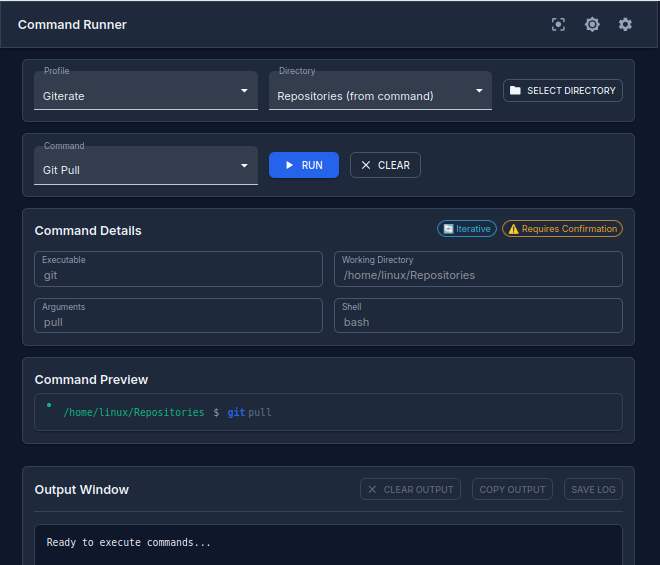
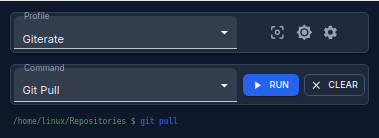
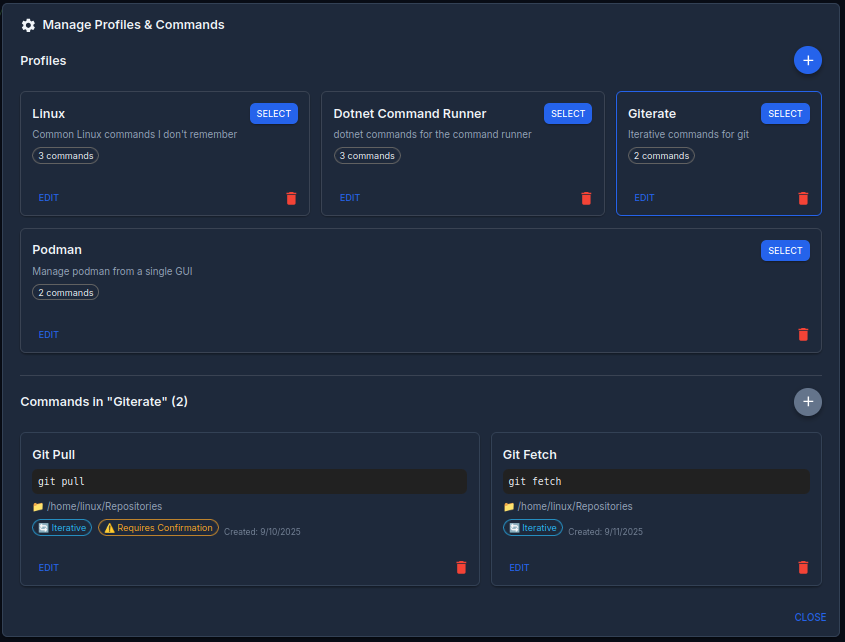

# Command Runner

A cross-platform desktop application for executing commands through a user-friendly interface. Built with React, TypeScript, Electron, and ASP.NET Core.

## Quick Start

1. **Download** the appropriate installer for your platform from [Releases](https://github.com/GitHub-Kieran/command-runner/releases)
2. **Install** and launch the application
3. **Create a profile** and add your first command
4. **Execute** commands with a click

## Features

### 🚀 **Multi-Directory Command Execution**
Execute commands across multiple directories simultaneously.



*Main application interface showing command execution across multiple directories*

### 🎯 **Compact Mode**
Focus mode provides a distraction-free interface for intensive command execution sessions, hiding unnecessary UI elements.



*Compact mode minimizes the interface for better focus during command execution*

### ⚙️ **Profile Management**
Create and manage command profiles with custom settings, environment variables, and execution parameters.


*Comprehensive profile configuration with environment variables and command settings*

### 🌐 **Cross-Platform Support**
Works seamlessly on Windows, Linux, and macOS with native file dialogs and platform-specific optimizations.

### 📁 **Directory Management**
Easily switch between working directories with a user-friendly selector.

### 🔄 **Command Iteration**
Run commands across multiple subdirectories recursively with configurable depth and error handling options.

### 🌓 **Theme Support**
Built-in dark and light themes for comfortable viewing in any environment or lighting condition.

## Upcoming Features

- **Progress Tracking**: Stream command outputs to the output window
- **Drag & Drop**: Reorder commands or profiles
- **Keyboard Shortcuts**: Use keys to select and execute commands
- **Multiple Execution**: Combine commands and run them together
- **Multiple Directories**: Add multiple directories to a command for quick switching
- **Profile Import**: Get up and running faster by importing pre-built profiles

## Desktop App Installation

### Linux

#### Option 1: Debian/Ubuntu (.deb)
1. Download the latest `.deb` file from the [Releases](https://github.com/GitHub-Kieran/command-runner/releases) page
2. Install using your package manager: `sudo dpkg -i command-runner_*.deb`
3. If there are dependency issues, run: `sudo apt-get install -f`

#### Option 2: AppImage
1. Download the latest `.AppImage` file from the [Releases](https://github.com/GitHub-Kieran/command-runner/releases) page
2. Make the file executable: `chmod +x Command-Runner-*.AppImage`
3. Run the AppImage: `./Command-Runner-*.AppImage` or right click and run

#### Option 3: Other Linux Distributions
For distributions not supporting .deb or AppImage:
```bash
cd src/CommandRunner.ReactWebsite
npm run build-electron-linux
```
### Windows

1. Download the latest `.exe` installer from the [Releases](https://github.com/GitHub-Kieran/command-runner/releases) page
2. Run the installer and follow the setup wizard
3. The app will be installed and available in your Start Menu

Note: Windows may handle built-in shell commands differently to other platforms. For example, to run 'dir' you can use 'cmd' as the executable and shell, with '/c dir' as the arguments.

### macOS

1. Download the latest `.dmg` file from the [Releases](https://github.com/GitHub-Kieran/command-runner/releases) page
2. Open the DMG file and drag the app to your Applications folder
3. Launch the app from Applications

## Development Setup

### Prerequisites

- Node.js 18+ and npm
- Git
- .NET 8.0 SDK (for API backend)

### Installation & Running

1. **Clone the repository:**
   ```bash
   git clone https://github.com/GitHub-Kieran/command-runner.git
   cd command-runner
   ```

2. **Start the API server** (in a separate terminal):
   ```bash
   cd src/CommandRunner.Api
   dotnet run
   ```
   The API will be available at `http://localhost:5081`

3. **Setup and start the frontend** (in another terminal):
   ```bash
   cd src/CommandRunner.ReactWebsite
   npm install
   npm run electron-dev
   ```

This will start both the Vite dev server and Electron app with hot reloading.

### Building for Production

#### Build Electron App
```bash
cd src/CommandRunner.ReactWebsite

# Build for current platform
npm run build-electron

# Build for Linux only
npm run build-electron-linux

# Build for Windows only
npm run build-electron-win
```

The built packages will be available in `src/CommandRunner.ReactWebsite/dist-electron/`.

## Keyboard Shortcuts

Coming soon...

## Architecture

```
src/
├── CommandRunner.ReactWebsite/     # React frontend + Electron wrapper
│   ├── electron/                   # Electron main process files
│   ├── public/                     # Static assets
│   ├── src/                        # React application source
│   └── package.json                # Electron dependencies and scripts
├── CommandRunner.Api/              # ASP.NET Core API backend (REQUIRED)
├── CommandRunner.Business/         # Business logic layer
├── CommandRunner.Data/             # Data access layer
└── CommandRunner.Console/          # Console application
```

## Troubleshooting

### Common Issues

**App won't start on Linux:**
- Try the .deb package instead of AppImage
- Run: `sudo apt-get install -f` to fix dependencies

**API connection errors:**
- Ensure the API server is running on port 5081
- Check firewall settings
- In development, start the API: `cd src/CommandRunner.Api && dotnet run`

**Build issues:**
- Ensure .NET 8.0 SDK is installed
- Clear node_modules: `rm -rf node_modules && npm install`

**Permission issues:**
- On Linux: `chmod +x Command-Runner-*.AppImage`
- On Windows: Run as administrator if needed

## Contributing

1. Fork the repository
2. Create a feature branch: `git checkout -b feature/your-feature`
3. Make your changes and test thoroughly
4. Commit your changes: `git commit -am 'Add some feature'`
5. Push to the branch: `git push origin feature/your-feature`
6. Submit a pull request

## License

This project is licensed under the GNU General Public License v3.0 - see the [LICENSE](LICENSE) file for details.

## Support

If you encounter any issues or have questions:

1. Check the [Issues](https://github.com/GitHub-Kieran/command-runner/issues) page
2. Create a new issue with detailed information about your problem
3. Include your operating system, app version, and steps to reproduce

## Changelog

See [Releases](https://github.com/GitHub-Kieran/command-runner/releases) for the latest changes and version history.
