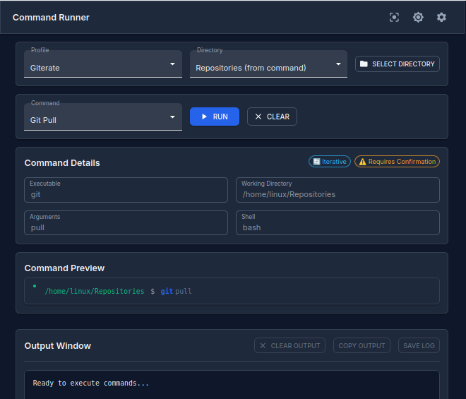
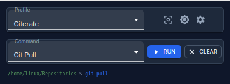
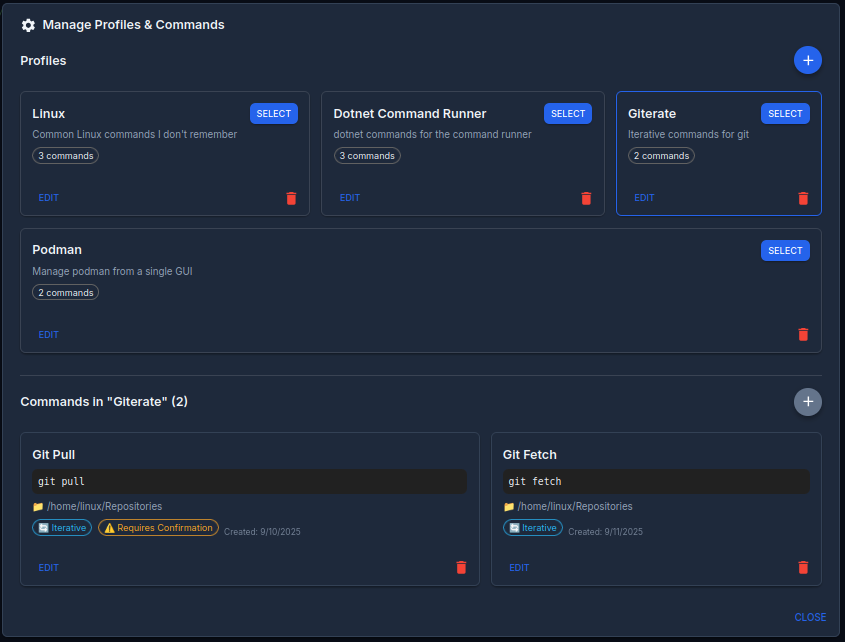

# Command Runner

A cross-platform desktop application for executing commands through a user-friendly interface. Built with Vue, TypeScript, Photino, and ASP.NET Core.

 

## Quick Start

1. **Download** the appropriate installer for your platform from [Releases](https://github.com/GitHub-Kieran/command-runner/releases)
2. **Install** and launch the application
3. **Create a profile** and add your first command
4. **Execute** commands with a click

## Features

### 🚀 **Multi-Directory Command Execution**
Execute commands across multiple directories simultaneously.



*Main application interface showing command execution across multiple directories*

### 🎯 **Compact Mode**
Focus mode provides a distraction-free interface for intensive command execution sessions, hiding unnecessary UI elements.



*Compact mode minimizes the interface for better focus during command execution*

### ⚙️ **Profile Management**
Create and manage command profiles with custom settings, environment variables, and execution parameters.

- Import profile files directly from JSON
- Reorder profiles and commands with drag-and-drop in the profile manager


*Comprehensive profile configuration with environment variables and command settings*

### 🌐 **Cross-Platform Support**
Works seamlessly on Windows, Linux, and macOS with native file dialogs and platform-specific optimizations.

### 📁 **Directory Management**
Easily switch between working directories with a user-friendly selector.

### 🔄 **Command Iteration**
Run commands across multiple subdirectories recursively with configurable depth and error handling options.

### 📡 **Live Output Streaming**
See command output in real time while commands are still running, including iterative runs across directories.

### 🌓 **Theme Support**
Built-in dark and light themes for comfortable viewing in any environment or lighting condition.

## Upcoming Features

- **Keyboard Shortcuts**: Use keys to select and execute commands
- **Multiple Execution**: Combine commands and run them together
- **Multiple Directories**: Add multiple directories to a command for quick switching

## Desktop App Installation

Desktop installers include the API backend and start it automatically when the app launches. You should not need to manually run the API in normal desktop usage.

Downloads are plain archives (not installers) — extract and run. There's no auto-update yet, so re-download from Releases for new versions.

### Linux

1. Download the latest `CommandRunner-linux-x64.tar.gz` from the [Releases](https://github.com/GitHub-Kieran/command-runner/releases) page
2. Extract it: `tar xzf CommandRunner-linux-x64.tar.gz -C CommandRunner && cd CommandRunner`
3. Make the binary executable: `chmod +x CommandRunner.Desktop`
4. Run it: `./CommandRunner.Desktop`

Requires `libwebkit2gtk-4.1-0` (or `libwebkit2gtk-4.0-37` on older distributions) — this is a system dependency and is not bundled, the same as any WebKitGTK-based desktop app. Install it via your distro's package manager if the app fails to start.

### Windows

1. Download the latest `CommandRunner-win-x64.zip` from the [Releases](https://github.com/GitHub-Kieran/command-runner/releases) page
2. Extract the zip anywhere
3. Run `CommandRunner.Desktop.exe`

Requires the WebView2 Runtime, which is preinstalled on Windows 11 and delivered via Windows Update on Windows 10.

Note: Windows may handle built-in shell commands differently to other platforms. For example, to run 'dir' you can use 'cmd' as the executable and shell, with '/c dir' as the arguments.

### macOS

1. Download the latest `CommandRunner-osx-x64.zip` from the [Releases](https://github.com/GitHub-Kieran/command-runner/releases) page
2. Extract the zip
3. Run `CommandRunner.Desktop`

### Data Storage

Command Runner stores user profiles and settings in the following locations:

- **Windows**: `%APPDATA%\CommandRunner\` (typically `C:\Users\<username>\AppData\Roaming\CommandRunner\`)
- **Linux**: `~/.config/CommandRunner/` (or fallback to the application directory if not accessible)
- **macOS**: `~/Library/Application Support/CommandRunner/`

Profile data is stored as JSON files in these directories and persists between application sessions.

## Development Setup

### Prerequisites

- Node.js 18+ and npm
- Git
- .NET 10.0 SDK (for API/backend projects)

### Installation & Running

1. **Clone the repository:**
   ```bash
   git clone https://github.com/GitHub-Kieran/command-runner.git
   cd command-runner
   ```

2. **Start the app from VS Code (recommended)**
   - Select launch config: `Command Runner Desktop (Photino)`
   - This starts the Vite dev server, then launches the Photino desktop host pointed at it

3. **Alternative manual start** (two terminals)

   **Vue dev server:**
   ```bash
   cd src/CommandRunner.Website.VueJs
   npm install
   npm run dev
   ```
   Runs at `http://localhost:5174` with hot reloading.

   **Desktop host** (hosts the API itself — no separate API process needed):
   ```bash
   dotnet run --project src/CommandRunner.Desktop
   ```
   In `DEBUG` builds this loads the Vite dev server above instead of a built static bundle, so UI changes hot-reload.

### Building for Production

```bash
cd src/CommandRunner.Website.VueJs && npm run build   # must run first -- populates CommandRunner.Desktop's wwwroot
dotnet publish src/CommandRunner.Desktop -c Release -r linux-x64 --self-contained true -o publish/linux
# or win-x64 / osx-x64
```

The published output is a self-contained folder — zip or tar it up for distribution. See `.github/workflows/photino-build.yml` for the exact commands CI uses per platform.

## Example Profiles

You can import ready-to-use profile files from [`examples/profiles`](examples/profiles):

- [`dotnet-local-dev.json`](examples/profiles/dotnet-local-dev.json)
- [`javascript-tooling.json`](examples/profiles/javascript-tooling.json)
- [`windows-maintenance.json`](examples/profiles/windows-maintenance.json)

Import flow:
1. Open **Settings**
2. Select **Import Profile**
3. Choose one of the JSON files above

## Keyboard Shortcuts

Coming soon...

## Architecture

```
src/
├── CommandRunner.Website.VueJs/    # Vue frontend
│   ├── src/                        # Vue application source
│   └── package.json                # Frontend dependencies and scripts
├── CommandRunner.Api/              # ASP.NET Core API — vertical feature slices; owns models,
│                                    # repositories, business services, controllers, and DTOs
├── CommandRunner.Desktop/          # Photino host: serves the API + Vue's built static files
│                                    # from one process, then opens a native webview window
└── CommandRunner.Console/          # Console application
```

## Troubleshooting

### Common Issues

**App won't start on Linux:**
- Install `libwebkit2gtk-4.1-0` (or `libwebkit2gtk-4.0-37` on older distributions) via your package manager
- If the window opens but stays blank/white, this is a known WebKitGTK rendering issue under virtualized/software-rendered GPUs (e.g. VirtualBox VMs) — should already be worked around automatically; if it recurs, see the note in `CLAUDE.md`

**API connection errors:**
- The desktop app hosts its own API internally on an OS-assigned port — there's nothing to configure
- If running the API standalone in development, check it's listening (`cd src/CommandRunner.Api && dotnet run`, default `http://localhost:5085`) and check firewall settings

**Build issues:**
- Ensure .NET 10.0 SDK is installed
- Clear node_modules: `rm -rf node_modules && npm install`
- Make sure `npm run build` has been run in `src/CommandRunner.Website.VueJs` before building `CommandRunner.Desktop` — otherwise it publishes with no bundled UI

**Permission issues:**
- On Linux/macOS: `chmod +x CommandRunner.Desktop` after extracting
- On Windows: Run as administrator if needed

## Contributing

1. Fork the repository
2. Create a feature branch: `git checkout -b feature/your-feature`
3. Make your changes and test thoroughly
4. Commit your changes: `git commit -am 'Add some feature'`
5. Push to the branch: `git push origin feature/your-feature`
6. Submit a pull request

## License

This project is licensed under the GNU General Public License v3.0 - see the [LICENSE](LICENSE) file for details.

## Support

If you encounter any issues or have questions:

1. Check the [Issues](https://github.com/GitHub-Kieran/command-runner/issues) page
2. Create a new issue with detailed information about your problem
3. Include your operating system, app version, and steps to reproduce

## Changelog

See [Releases](https://github.com/GitHub-Kieran/command-runner/releases) for the latest changes and version history.


# TODO
[x] Claude.md
[x] Convert to VueJs
[x] Convert to Vertical Architecture
[x] Remove old React/Electron version and build pipeline
[x] Fix windows unit test failures